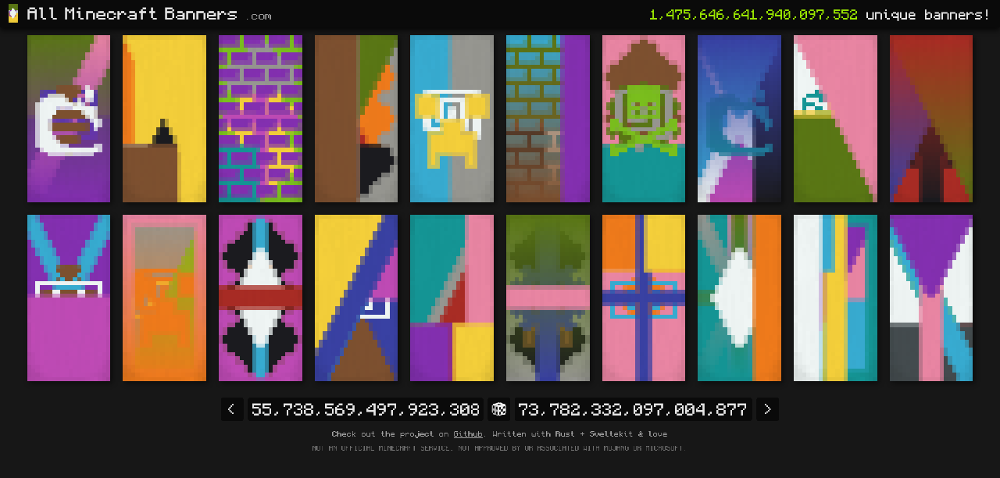

# all_minecraft_banners



this project includes all **1,475,646,641,940,097,552** banners in Minecraft!!  

## Rust backend
fast minecraft banner generation with `25µs~` on average (20x40px).  
technically supports custom patterns (tho rng will be different).  
generate new banners/pattern lists or get consistent ones with a seed.  
with `1-2ms` for an entire request to process on the server.  

there is one other crate in this cargo workspace: `mcb`:  
this crate handles the basics of creating banners via patterns & colors.  
like tinting patterns & banners, overlaying them and cropping the textures.  

as for the main backend:  
`generation.rs` handles the... well generation of patterns, seeds & such.  
`handlers.rs` handles the uhh route handlers from axum.  
`query.rs` handles query arguments since patterns have a little custom format.  
and `main.rs` for loading everything up and starting the api server. 

### api
base: *0.0.0.0:8213*

- `/`  
    Basis string to check if the server is online.  
- `/create`  
    Can be used with the query arguments below to create a custom banner without any randomness.  
- `/banner`  
    Generate a random banner with a new random seed.  
- `/banner/:seed`  
    Generate a banner based from a seed.  
- `/pattern`  
    Generate a list of random patterns with a new random seed.  
- `/pattern/:seed`  
    Generate a list of patterns from a seed.  
- `/seed`  
    Generate a new seed within the determined range.  
- `/metadata`  
    Returns a list of all available banner patterns, all the colors & how many combinations are possible.  


`/create`, `/banner`, `/banner:id`, `/pattern` & `/pattern/:id` all accepts some query arguments.  
- `base_color`  
    Specify a base color to always use instead of a random seeded one.  
    Specify the number representing the color in the enum (0-15).  
- `layers`  
    Specify a list of layers that will override the random seeded one.  
    Example: `?layers=&layers=&layers=[2, 7]` will always set layer 3 to `bricks` with the color `Gray`.  
    This can be used with any of the above endpoints & takes priority over any randomness.  
- `max_layers`  
    Specify how many layers will be used to generate the banner.  

Only endpoints which returns an image directly can use:  
- `width`  
    Specify the width in pixels, height will automatically become `width * 2`.  

### patterns
for the backend to even work at all, it needs a source of patterns it can draw from & use.  
these should be placed in `/patterns/*.png` (from project root).  
patterns are 64x64 and the vanilla ones from the game itself can be downloaded via [mcmeta](github.com/misode/mcmeta).  
one downside to how backend is structured, is that if you add a new pattern.  
***i think*** all previous seeds gets changed due to a new pattern,  
this in turn invalidates all links which point to a specific seed.  
i don't personally care for this when mojang adds new patterns but uhhhhh.  
and also when any patterns are updated, they should also be updated in the client [asset_resolver.ts](client/src/lib/asset_resolver.ts).  
this is so it can resolve the names and if a pattern has an exlusive item tied to it.  

### building

#### debug
```sh
cargo r
```
#### release
```sh
cargo b -r
# or this if u wanna run it instantly
cargo r -r
```
the released backend binary has heavily optimizations enabled, targets your native cpu & uses mimalloc.  


## Sveltekit frontend
comes with a client/frontend built with `SvelteKit`.  
Hosted at [allminecraftbanners.com](https://allminecraftbanners.com).  

Can be used to interact the rust backend, view every single random banner.  
View specific banners via their seed, and even customize and change the banners.  

The client does have some delay on every navigation as to prevent easy spamming on the server.  
I mean, the backend is so fucking fast it doesn't *really* matter.  

### .env
the client only has 1 singular config, where the rust backend is hosted at:
```sh
PUBLIC_API = "http://localhost:8213"
```

### building
#### dev
```sh
npm i
npm run dev
```
#### production
```sh
npm i
npm run build
# must have node 20.6+
node --env-file=.env build
```